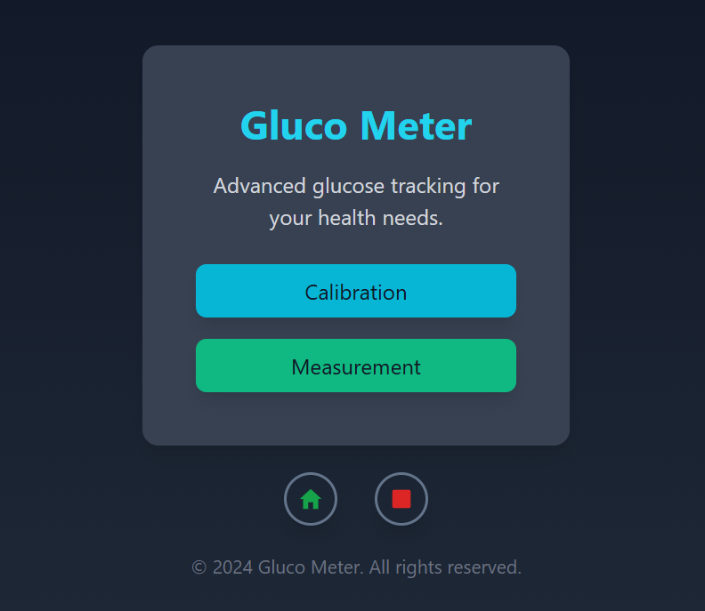
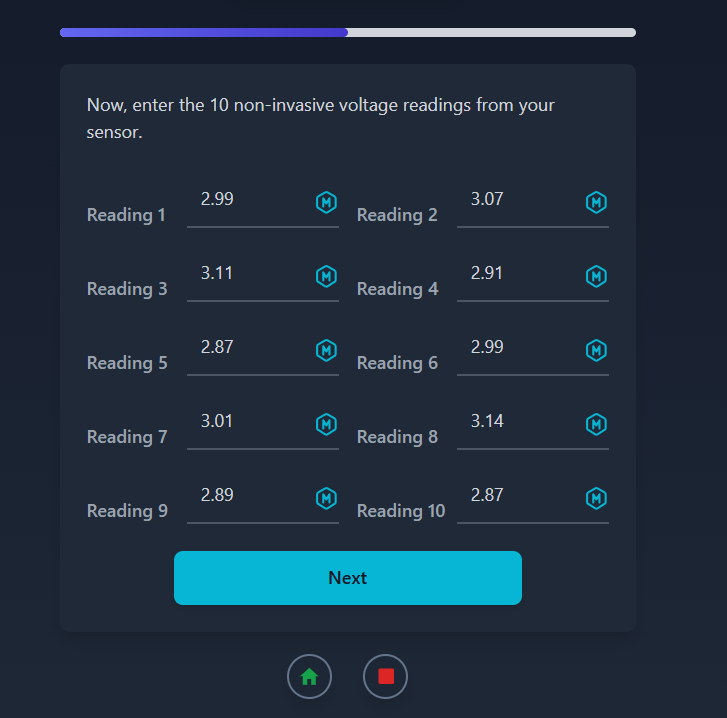
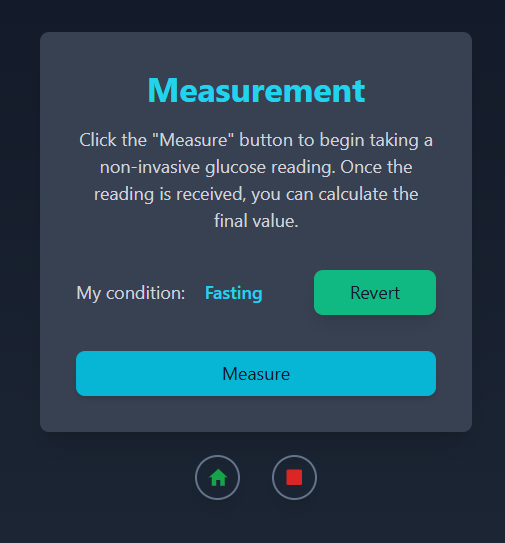

# GlucoMeter – Non-Invasive Blood Glucose Monitoring System

A full-stack healthcare platform designed to work with a custom-built non-invasive glucometer device, helping users monitor blood glucose levels, manage calibration data, and track measurements through an intuitive web interface.

> Built with React.js, Node.js, MongoDB, Mongoose, Tailwind CSS, Arduino, and Optical Sensors.




## Live Demo

https://glucometer.vercel.app/


## Overview

GlucoMeter was developed as a 5th-semester Electronic Circuit Design project to explore non-invasive blood glucose monitoring using optical sensing techniques.

The system combines custom-built hardware with a web application that guides users through device calibration, performs glucose measurements, and converts sensor readings into estimated blood glucose values using calibration data.

Users can calibrate the device using real glucose readings, perform fasting or post-meal measurements, and interact directly with the physical device through the web application.


## Features

- Non-invasive glucose monitoring workflow
- Custom calibration process using invasive and non-invasive readings
- Default calibration support for quick setup
- Fasting and post-meal measurement modes
- Real-time sensor data acquisition
- Glucose estimation based on calibration data
- Device-to-web communication through Node.js
- Physical alarm control from the web application
- Measurement history management
- Healthcare-focused user experience

---

## Tech Stack

### Frontend

- React.js
- Tailwind CSS

### Backend

- Node.js
- Express.js

### Database

- MongoDB
- Mongoose

### Hardware

- Arduino
- Optical Sensors
- Breadboard Prototyping
- Custom Circuit Design


## How It Works

### Calibration Phase

Users can choose between:

- Default Calibration
- Custom Calibration

For custom calibration:

- 10 invasive glucose readings are entered
- 10 non-invasive sensor readings are collected
- The system generates calibration parameters used for future measurements

### Measurement Phase

1. Select measurement condition:
   - Fasting
   - Post Meal

2. Start measurement

3. Device captures optical sensor data

4. Sensor values are processed using stored calibration data

5. Estimated blood glucose value is displayed

6. Users can stop the device alarm directly from the application


## Architecture

```text
┌─────────────────────┐
│     React.js UI     │
└──────────┬──────────┘
           │
           ▼
┌─────────────────────┐
│   Node.js API       │
└──────────┬──────────┘
           │
   ┌───────┴────────┐
   │                │
   ▼                ▼
 MongoDB        Arduino Device
(User Data)    (Optical Sensors)
   │                │
   └───────┬────────┘
           ▼
     Calibration Engine
     Glucose Estimation
     Alarm Control
```


## Screenshots

### Home


### Calibration Process



### Measurement Screen




## Project Structure

```text
glucometer/
├── public/
├── src/
│   ├── api/
│   ├── assets/
│   ├── components/
│   ├── data/
│   ├── App.jsx
│   ├── index.css
│   └── main.jsx
```


## Key Challenges

### Hardware & Software Integration

Integrating Arduino-based hardware with a web application required reliable serial communication and real-time data handling between the device and the Node.js backend.

### Real-Time Measurement Processing

The system needed to process incoming sensor values, apply calibration logic, update the UI, and control hardware alarms in real time.


## What I Learned

- React and Node.js integration
- Hardware-software communication
- Arduino + Web interaction
- Calibration-based data processing
- Building healthcare-oriented applications


## Future Improvements

- User authentication
- Patient profiles
- Measurement history analytics
- Doctor dashboard
- PDF health reports
- Mobile application support
- Cloud synchronization
- AI-powered glucose trend analysis


## Academic Context

This project was developed as part of the **Electronic Circuit Design** course and combines embedded systems, sensor integration, and full-stack web development to create a practical healthcare monitoring solution.


## If you found this project interesting, consider giving it a star ⭐
